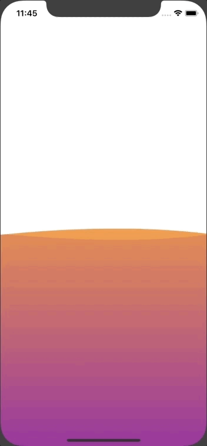

# Uneri
Uneri (うねり) is a wave animation view library. 🌊

## Screenshot



## Installation

### CocoaPods

[CocoaPods](http://cocoapods.org) is a dependency manager for Cocoa projects. You can install it with the following command:

```bash
$ gem install cocoapods
```

To integrate Uneri into your Xcode project using CocoaPods, specify it in your `Podfile`:

```ruby
source 'https://github.com/CocoaPods/Specs.git'
platform :ios, '11.0'
use_frameworks!

target '<Your Target Name>' do
    pod 'Uneri'
end
```

Then, run the following command:

```bash
$ pod install
```

### Carthage

[Carthage](https://github.com/Carthage/Carthage) is a decentralized dependency manager that builds your dependencies and provides you with binary frameworks.

You can install Carthage with [Homebrew](http://brew.sh/) using the following command:

```bash
$ brew update
$ brew install carthage
```

To integrate Uneri into your Xcode project using Carthage, specify it in your `Cartfile`:

```ogdl
github "jimmythai/Uneri"
```

Run `carthage update` to build the framework and drag the built `Uneri.framework` into your Xcode project.

## Requirements

* iOS 8.0+
* Xcode 9.0+
* Swift 4+

## Usage

### Initialization

```swift
import Uneri

let oceanHeight = CGFloat(200)
let frame = CGRect(x: 0, y: view.frame.size.height - oceanHeight, width: view.frame.size.width, height: oceanHeight)

// with default colors
let uneri0 = Uneri(frame: frame)

// with custom colors
let uneri1 = Uneri(frame: frame, mainColor: .orange, subColor: .purple)

// width custom gradient colors
let uneri2 = Uneri(frame: frame, mainGradientColors: [.orange, .purple], subGradientColors: [.purple, .purple])

// the uneri automatically starts
view.addSubview(uneri0)
```

### Settings

```swift
// uneri speed, 0.5 by default
uneri.uneriSpeed = 0.8

// uneri height, 10.0 by default
uneri.uneriHeight =8.0

// main uneri color, .orange by default
uneri.mainColor = .red

// sub uneri color, .purple by default
uneri.subColor = .orange

// main gradient colors, [.orange, .purple] by default
uneri.mainGradientColors = [.red, .orange]

// sub gradient colors, [.purple, .orange] by default
uneri.subGradientColors = [.orange, .red]

// main alpha, 0.7 by default
uneri.mainAlpha = 0.6

// sub alpha, 0.1 by default
uneri.subAlpha = 0.2
```

### Controling Uneri animation

```swift
// pause the uneri animation
uneri.pause()

// resume the uneri animation
uneri.resume()
```

## License

Uneri is released under the MIT license. See [LICENSE](LICENSE) for details.
